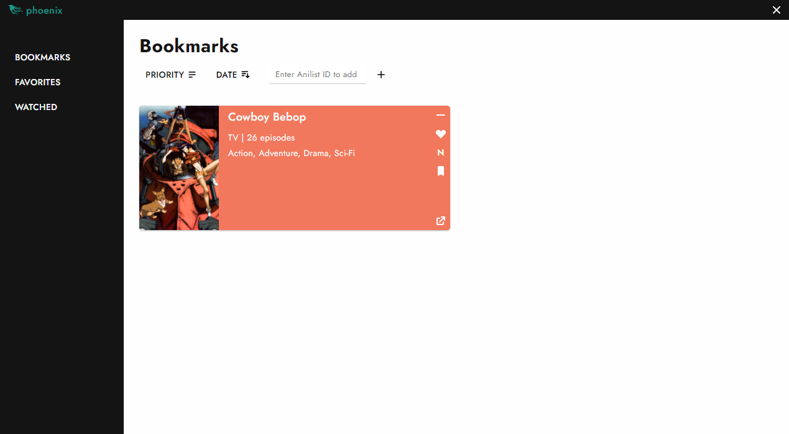

# phoenix 
## Version 1.0.1

`phoenix` is an anime bookmarking app written on `electron.js`.
It uses [Anilist](https://anilist.co/search/anime) API to add bookmarks and localizes the bookmarked data on the user's PC.  



To start in development mode.
```
npm start
```
To build the app using [electron-packager](https://www.npmjs.com/package/electron-packager) (default configuration is win32)
```
npm run package
```

